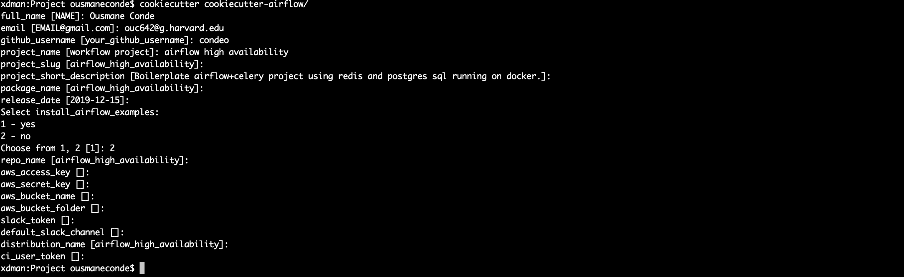

# cookiecutter airflow high availability

This cookiecutter generates a high availability airflow(webserver, scheduler, workers) application. 
The generated application uses celery, redis, postgres sql and runs on a highly scalable docker/kubernetes environment. 
It also uses slack for realtime notifications. To create a slack bot token, please refer to
[this](https://slack.com/help/articles/215770388-Create-and-regenerate-API-tokens).

##### Health status
[](https://travis-ci.com/csci-e-29/2019fa-final-project-condeo)

[](https://codeclimate.com/repos/5df69446d07d92016300451e/test_coverage)

[](https://codeclimate.com/repos/5df69446d07d92016300451e/maintainability)


<!-- START doctoc generated TOC please keep comment here to allow auto update -->
<!-- DON'T EDIT THIS SECTION, INSTEAD RE-RUN doctoc TO UPDATE -->
**Table of Contents**  *generated with [DocToc](https://github.com/thlorenz/doctoc)*

- [Features](#features)
- [Requirements](#requirements)
- [Installation](#installation)
- [Running the test coverages locally](#running-the-test-coverages-locally)
- [Quickstart](#quickstart)
- [Instructions to run Airflow environment](#instructions-to-run-airflow-environment)
- [License](#license)

<!-- END doctoc generated TOC please keep comment here to allow auto update -->

# Features
In order to experience the features below, please build a project from this cookiecutter template and 
check the Readme file of the generated project [here](%7B%7Bcookiecutter.repo_name%7D%7D/Readme.md).
To generate your project, simply run ```cookiecutter cookiecutter-airflow```

> **Apache Airflow**  for workflows scheduling and monitoring

> **DAG Programming**  showcasing how to build DAGs in python

> **Meta Programming**  to write code that dynamically generate programs

> **High Availability** : Multiple scalable micro-service containers (Web server, schedulers, workers)

> **REST API** : Interacting with Airflow via REST

> **Cookiecutter** to build DRY code

> **Dependencies management** with ``pipenv``

> **Testing**  with  ``pytest`` and ``hypothesis``

> **Flake8**  for code style guide enforcement

> **Travis-CI**  for continuous Integration testing

> **Codeclimate**  for automated code review tool

> **Doctoc**  to generate table of contents for markdown files


# Requirements
Install `cookiecutter` command line: `pip install cookiecutter`     
Install `pipenv`: ` brew install pipenv` if you are running on a mac


# Installation
```bash 
cookiecutter https://github.com/condeo/cookiecutter-airflow-ha.git
```



# Running the test coverages locally

This also runs flake8 as part of the tests
```bash
pipenv install
pipenv run pytest -v --flake8 --cov-report html --cov=./
```
To install extra packages, run pipenv install <package name>

I am also using[ hypothesis](https://hypothesis.works/hypothesis) for effective testing. Here is a very quick TL;DR 
to get started with hypothesis
```python
from hypothesis import assume, given, settings
from hypothesis.strategies import integers

@settings(max_examples=150)
@given(lists(integers(min_value=3, max_value=10)),integers(min_value=3, max_value=10))
def test_this_thoroughly(test_list, r):
    print('input list',test_list)
    print('input k:', r)
```

I strongly recommend also reading the documentation [here](https://hypothesis.readthedocs.io/en/latest/).


# Quickstart

Install Cookiecutter Cookiecutter 1.4.0 or higher)::

    pip install -U cookiecutter

Generate an airflow high availability project ::

    cookiecutter https://github.com/condeo/cookiecutter-airflow-ha.git

Then:

* consult the Readme file in the generated project [here](%7B%7Bcookiecutter.repo_name%7D%7D/Readme.md)

# Instructions to run Airflow environment
Step-by-step instructions to run airflow and test dags, meta programming, etc. are located 
[here](%7B%7Bcookiecutter.repo_name%7D%7D/Readme.md)

# License
This project is licensed under the terms of the [BSD License](/LICENSE)
