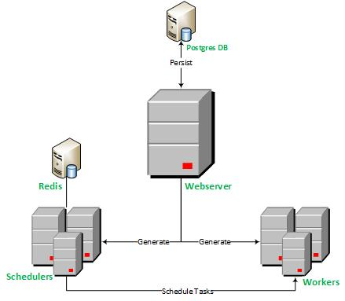

A high availability airflow (web server + scheduler + workers) application. 
This application uses celery, redis, postgres sql internally and runs on a highly scalable docker/kubernetes environment. 
It also uses slack for realtime notifications. To create a slack bot token, please refer to
[this](https://slack.com/help/articles/215770388-Create-and-regenerate-API-tokens).

<!-- START doctoc generated TOC please keep comment here to allow auto update -->
<!-- DON'T EDIT THIS SECTION, INSTEAD RE-RUN doctoc TO UPDATE -->
**Table of Contents**  *generated with [DocToc](https://github.com/thlorenz/doctoc)*

- [The Ecosystem](#the-ecosystem)
  - [Core Components](#core-components)
    - [Webserver](#webserver)
    - [Scheduler](#scheduler)
    - [Workers](#workers)
- [Minimal requirements](#minimal-requirements)
- [First Time Setup](#first-time-setup)
    - [Generate a Fernet Key](#generate-a-fernet-key)
    - [Build the Webserver image](#build-the-webserver-image)
    - [Verify that the webserver image is successfully built](#verify-that-the-webserver-image-is-successfully-built)
    - [Build the other containers images](#build-the-other-containers-images)
    - [Start the application](#start-the-application)
    - [Create a default pool for your application](#create-a-default-pool-for-your-application)
    - [Create a slack connection ID with your slack_bot token](#create-a-slack-connection-id-with-your-slack_bot-token)
    - [Login to the admin Dashboard](#login-to-the-admin-dashboard)
    - [create a variable dag_number](#create-a-variable-dag_number)
- [Interacting with the Application](#interacting-with-the-application)
    - [Webserver](#webserver-1)
    - [REST API](#rest-api)
    - [Monitoring Dashboard](#monitoring-dashboard)
    - [Gotchas](#gotchas)
  - [Testing](#testing)
- [TL;DR](#tldr)
    - [Resources](#resources)
- [License](#license)

<!-- END doctoc generated TOC please keep comment here to allow auto update -->
[](https://travis-ci.com/{{cookiecutter.repo_name}})

[](https://codeclimate.com/repos/{{cookiecutter.repo_name}}/test_coverage)

[](https://codeclimate.com/repos/{{cookiecutter.repo_name}}/maintainability)


 ## Core Components
The ecosystem of the application consists of auto-scalable docker containers as per the following Diagram

 
 ### Web server
User Interface allowing you to interact with the application to trigger jobs, create connections, etc...
All information entered here is persisted in a scalable postgres database.

### Scheduler
Orchestrates your workflow (schedule jobs, track job statuses, progress, etc...)

### Workers
This is where your tasks are actually being run. By scaling the number of workers, you can therefore process your work faster.
To scale the number of workers you can run the following commands:

```bash
docker-compose scale worker=15
docker-compose down airflow-scheduler
```
The first command will scale your environment to 15 workers, and the second command will recycle the scheduler to ensure 
that it detects the newly created workers. You can see if they we detected on the flower dashboard [here](http://localhost:5555/).

# Minimal requirements
Because this ecosystem is built to process big data at large scale and with high availability (99% uptime), it is 
therefore hardware resource hungry.

* [Docker > 2.1.0.5](https://www.docker.com/get-started)
* Docker settings
    * Minimum Memory: 16GB
    * Minimum CPU: 8 cores
    * Minimum Swap:3GB
* Slack Bot Token (Optional)

# First Time Setup
### Create a dotenv file at the root of your project with the following variables
The .env file should already be there. If so, please bypass this step. P.S: Make sure to update your .gitignore file 
in order not to push your .env file to git.
FYI: A Dotenv file is a zero-dependency file were you can declare your default environment variables and 
via docker-compose, these environment variables will be loaded into your docker environments. 
Learn more about dotenv files [here](https://docs.docker.com/compose/env-file/).
Your dotenv file should contain the following variables at the very least:
```
# contents of .env file
SALT=3f87b3a5b7e48ba408964366a71947xf249d4ed33b962a9e5d76c5d6124537bc
# REDIS ENVS
REDIS_VERSION=3.2.7

# Postgres ENVS
POSTGRES_VERSION=latest
POSTGRES_USER=airflow
POSTGRES_PASSWORD=airflow
POSTGRES_DB=airflow

# WEBSERVER ENVS
LOAD_EX=y
FERNET_KEY=aRp2EFTqmHrZX0y1XzJPvcKaHBdm4Go5bnKRrQ4a8Fw=
EXECUTOR=Celery
AWS_ACCESS_KEY={{ cookiecutter.aws_access_key }}
AWS_SECRET_ACCESS_KEY={{ cookiecutter.aws_secret_key }}
DEFAULT_SLACK_CHANNEL={{ cookiecutter.default_slack_channel }}
SLACK_BOT_TOKEN={{ cookiecutter.slack_token }}
S3_BUCKET_NAME={{ cookiecutter.aws_bucket_name }}
S3_BUCKET_FOLDER={{ cookiecutter.aws_bucket_folder }}
DAG_OWNER={{ cookiecutter.full_name|replace('_','-') }}

# FLOWER ENVS

# Scheduler
NO_PROXY=*

# Worker
C_FORCE_ROOT=1
```

### Generate a Fernet Key
This key is used internally by airflow for encryption. [More Info here](https://bcb.github.io/airflow/fernet-key).

Generate fernet_key, using this code snippet below. fernet_key must be a base64-encoded 32-byte key:
```bash
pip install cryptography
python -c "from cryptography.fernet import Fernet; print(Fernet.generate_key().decode())"
```
If you are using python3, then replace pip with pip3 and python with python3 in the commands above.
Paste the output of the command above (your generated fernet key) into your airflow.cfg 
(look for the variable fernet_key) somewhere towards the middle of the file.

### Paste your newly generated fernet key in your dotenv
So, you would replace the fernet key in the sample dotenv above with your own fernet key

### Build the Web server image
This is the image that we will be using in order to build the other containers, given that for instance, 
airflow scheduler, worker and webserver all have the same source code.
```bash
docker-compose build webserver
```

### Verify that the webserver image is successfully built
```bash
docker images
```
You should see an image named **{{ cookiecutter.package_name }}** (size is approximately +2GB)

### Build the other containers images
```bash
docker-compose build
```

### Start the application
```bash
docker-compose up
```

### Create a default pool for your application
:exclamation: **important**
Make sure you have set at least one default pool (default_pool) for airflow. Unless, your scheduler will not work.
Some systems can get overwhelmed when too many processes hit them at the same time. Airflow pools can be used to limit 
the execution parallelism on arbitrary sets of tasks. The list of pools is managed in the UI (Menu -> Admin -> Pools) 
by giving the pools a name and assigning it a number of worker slots. Tasks can then be associated with one of the existing pools by using the pool parameter when creating tasks (i.e., instantiating operators).
How to here [here](https://airflow.apache.org/docs/stable/concepts.html?highlight=pool)

### Create a slack connection ID with your slack_bot token
Go to [http://localhost:8080/admin/connection/] create a new connection with the following:
> conn_id=slack

> login=your slack channel name": channel where you wnat slack to send your messages

> password= your slack bot token 

### Login to the admin Dashboard
[http://localhost:8080/admin](http://localhost:8080/admin).

#### DAG Programming
You should see 10 hello_world dynamic dags that were automatically generated by the code located in 
dags/dag-of-dags-variables.py. This code features a powerful functionality of airflow, which is the  the creation of 
dynamic dags (dags that generate other dags).
This code leverages airflow variables to generate dags. 

### create a variable dag_number
Navigate to [http://localhost:8080/admin/variable/](http://localhost:8080/admin/variable/) 

#### Meta Programming
and create a new variable with key dag_number and a value of 20. Now restart your application, 
you should see now 20 dags dynamically created in your 
dashboard.

To learn more advanced features of airflow, please visit 
[here](https://www.astronomer.io/guides/dynamically-generating-dags/).

# Interacting with the Application
All these functionalities are out of the box.

### Web server
[http://localhost:8080/admin/](http://localhost:8080/admin/)

### REST API
```nashorn js
curl --request GET \
  --url http://localhost:8080/api/experimental/dags/hello_world_1/dag_runs \
  --header 'content-type: application/json' \
  --cookie session=eyJfZnJlc2giOmZhbHNlLCJjc3JmX3Rva2VuIjoiZTkxYjE1NzZhYmFkMzRmNjc5NmZiYzFhNDg5NjM0ODk2OWVmNzUyNSJ9.XfFIkA.ifiLHrmznXF1hC0zKqFQR2SzBZI
```
Learn more about the API [here](https://airflow.apache.org/docs/stable/api.html).

### Monitoring Dashboard
[http://localhost:5555/](http://localhost:5555/)

### Gotchas
1. Make sure you have set at least one default pool for airflow. Learn more [here](https://airflow.apache.org/docs/stable/concepts.html?highlight=pool)
2. Make sure you have set the FERNET_KEY in your application
3. Make sure you have set the C_FORCE_ROOT environment variable unless celery will not work.
3. TypeError: ... got an unexpected keyword argument 'conf'. You need to add *args, **kwargs to your functions
4. Use [Operators](https://airflow.apache.org/docs/stable/howto/operator/index.html) to define what to execute when your dag runs.
5. Avoid relative imports

## Testing
To run/test your code, do:
```bash
docker-compose run --rm webserver python /usr/local/airflow/[path-to-test-file].py
```
I am also using[ hypothesis](https://hypothesis.works/hypothesis) for effective testing. Here is a TL;DR 
on how to use hypothesis
```python
from hypothesis import assume, given, settings
from hypothesis.strategies import integers

@settings(max_examples=150)
@given(lists(integers(min_value=3, max_value=10)),integers(min_value=3, max_value=10))
def test_this_thoroughly(test_list, r):
    print('input list',test_list)
    print('input k:', r)
```
However, I strongly recommend also reading the documentation [here](https://hypothesis.readthedocs.io/en/latest/)

# Testing the Project Generated by this template
A step by step guide to use the project generated can be viewed [here](%7B%7Bcookiecutter.project_slug%7D%7D/Readme.md)

# TL;DR
Not recommended, but to automatically initialize your environment and bypass the initial setup, you can simply run in 
the ui, the dag called initialize_environment when your application launches the first time.

### Resources
[Airflow Key Concepts](https://airflow.apache.org/docs/stable/concepts.html)

[Airflow User Guide](https://github.com/astronomer/airflow-guides/blob/master/guides/airflow-ui.md)

[Other Airflow Guides](https://github.com/astronomer/airflow-guides/tree/master/guides)

# License
This project is licensed under the terms of the [BSD License](/LICENSE)